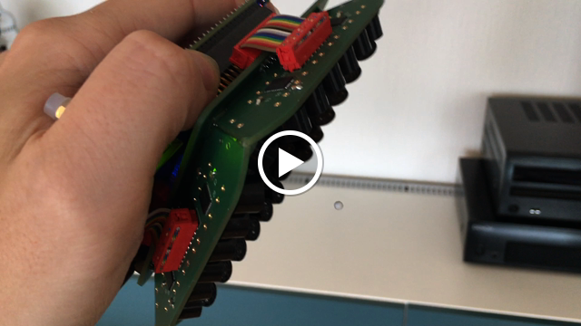
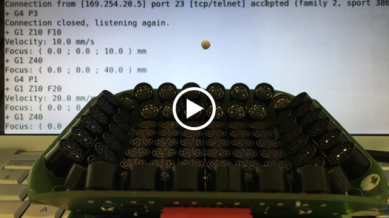
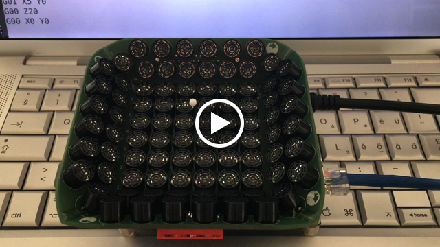

# Acoustic levitation

An acoustic levitation device designed as a daughterboard for the [DE0-Nano-SoC](http://www.terasic.com.tw/cgi-bin/page/archive.pl?Language=English&CategoryNo=165&No=941) (Terasic Inc.)

The piezoelectric transducers signals generation is written in VHDL. The phases computation and G-Code interpreter is written in C and runs on embedded Linux.

## Demonstration videos

#### Levitation of a 3 mm EPS particle in hand

#### Up and down movements using G-Code

#### 2 mm EPS particle following a toolpath exported from FlatCAM

Toolpath:

## References

1. A. Marzo, S. A. Seah, B. W. Drinkwater, D. R. Sahoo, B. Long, and S. Subramanian, *Holographic acoustic elements for manipulation of levitated objects*, Nature Communications 6, 8661, 2015.  
   <https://www.nature.com/articles/ncomms9661>
2. A. Marzo, *GauntLev: A Wearable to Manipulate Free-floating Objects*, Proceedings of the 2016 CHI Conference on Human Factors in Computing Systems (CHI '16), 3277-3281, 2016.  
   <https://dl.acm.org/citation.cfm?id=2858370>
3. A. Marzo, M. Caleap, and B. W. Drinkwater, *Acoustic Virtual Vortices with Tunable Orbital Angular Momentum for Trapping of Mie Particles*, Phys. Rev. Lett. 120, 044301, 2018.  
   <https://journals.aps.org/prl/abstract/10.1103/PhysRevLett.120.044301>
4. A. Künstner, *Lévitation acoustique*, Bachelor thesis, hepia, University of Applied Sciences Western Switzerland (HES-SO), Geneva, Switzerland, 2017.
